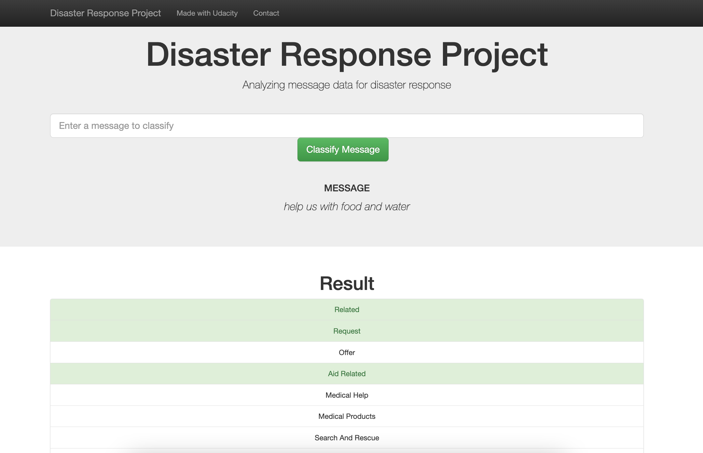
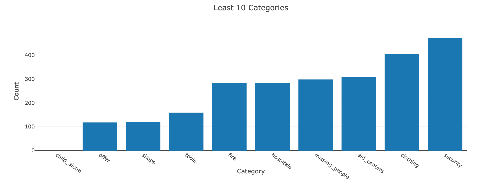
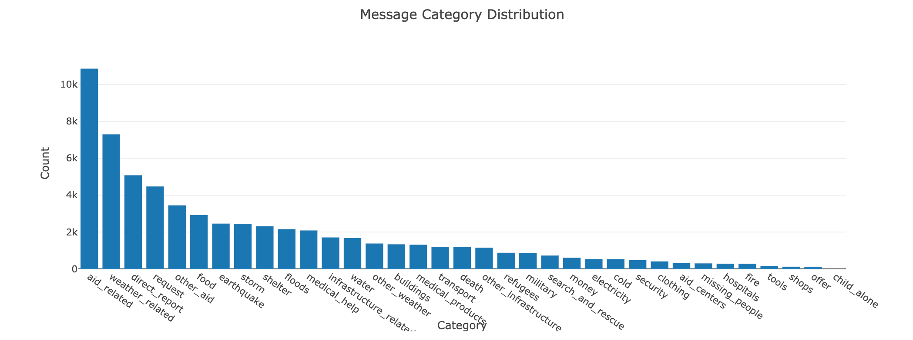
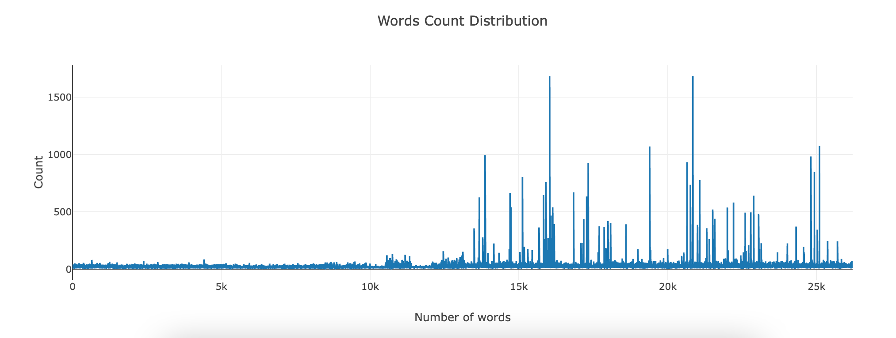

# Udacity's Disaster Response Pipeline Project

## Project Description
The Disaster Response Pipeline is a part of the Nanodegree Program by Udacity, in collaboration with Figure Eight. For this project we have built a Machine Learning model that classifies the emergency of the message from real-life disasters events ,based on the information and needs communicated by the sender. This also includes a web app where a new message can be classification results in the 36 pre-defined categories.

## Project Components
The project is divided in three major parts

### 1. ETL Pipeline
Data Processing Pipeline, to load data from source, merge and clean the data and save it in a SQLite database.
### 2. ML Pipeline
2. Machine Learning Pipeline, to load the SQLite database, split the dataset into training and test sets, build and train the model using GridSearchCV and export the final model as pkl file.
### 3. Flask Web App
3. Web App to show data visualisation and model results using Plotly in real time.

## Getting Started

### Dependencies

1. Python 3.10.4
2. Machine Learning Libraries: NumPy, SciPy, Pandas, Sciki-Learn
3. Natural Language Process Libraries: NLTK
4. SQLlite Database Libraqries: SQLalchemy
5. Web App and Data Visualization: Flask, Plotly

A requirements.txt file is created to install all the dependencies needed for this project. To install them run following command.

```pip install -r requirements.txt```

## Authors
* [MehzHats](https://github.com/MehzHats)

## License
[](https://opensource.org/licenses/MIT)


## Instructions:
1. Run the following commands in the project's root directory to set up your database and model.

    - To run ETL pipeline that cleans data and stores in database
        `python data/process_data.py data/disaster_messages.csv data/disaster_categories.csv data/DisasterResponse.db`
    - To run ML pipeline that trains classifier and saves
        `python models/train_classifier.py data/DisasterResponse.db models/classifier.pkl`

2. Run the following command in the app's directory to run your web app.
    `python run.py`

3. Go to http://0.0.0.0:3001/


## Screenshots

1. This is an example of a message you can type to test Machine Learning model performance.



2. This is the data visualisation for the least 10 categories.



3. This is the data visualisation for the message category distribution.



4. This is the data visualisation for the words count distribution.




## Acknowledgements

* [Udacity](https://www.udacity.com/) Data Science Nanodegree Program
* [Appen](https://appen.com/) Data from Appen (formally Figure 8) to build a model for an API that classifies disaster messages.